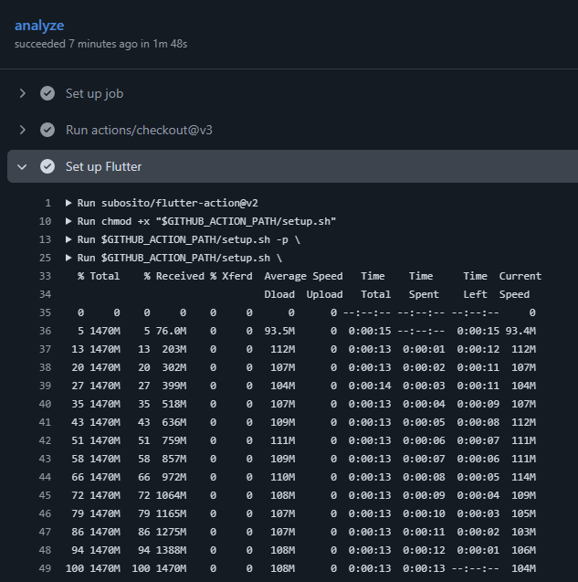
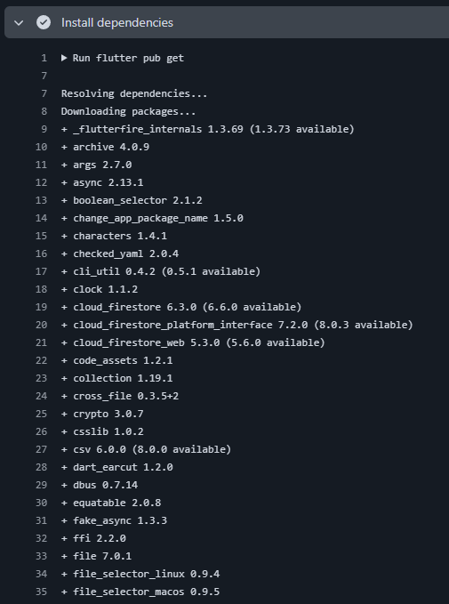
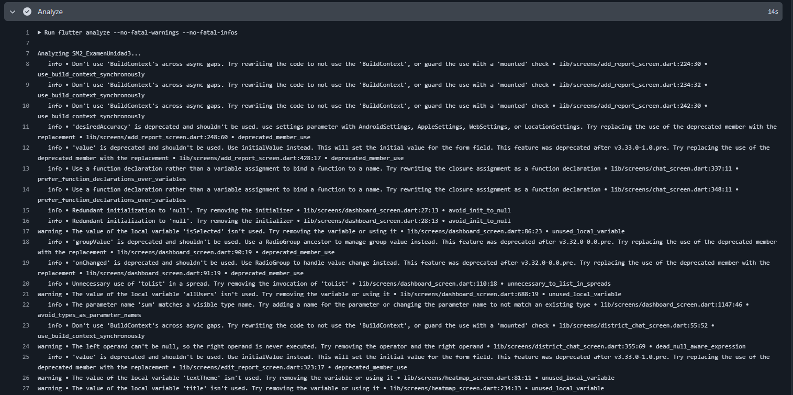
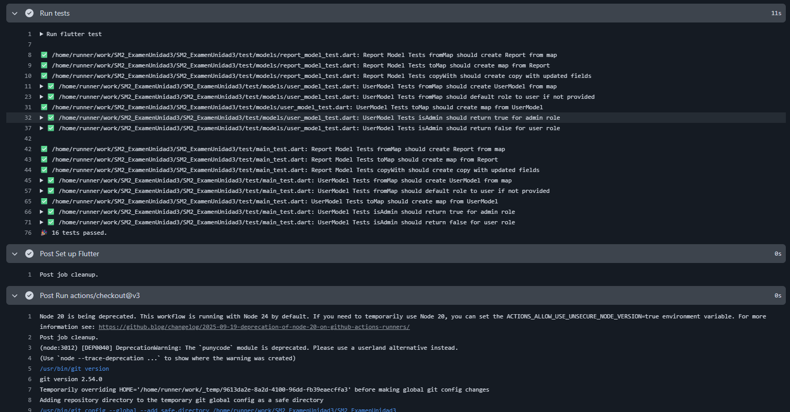

# Examen Práctico – Unidad III  
**Curso:** Soluciones Móviles II    
**Tema:** Automatización de calidad con GitHub Actions  
**Fecha:** 23 de junio de 2026  
**Estudiante:** Jesus Humberto Escalante Alanoca  

---

## Repositorio  
**URL:** [https://github.com/JesusEscalante/SM2_ExamenUnidad3](https://github.com/JesusEscalante/SM2_ExamenUnidad3.git)  

---

## Estructura del proyecto  
El repositorio contiene la siguiente estructura (se muestran solo los archivos relevantes para el examen):


SM2_ExamenUnidad3/<br>
├── .github/<br>
│ └── workflows/<br>
│ └── quality-check.yml<br>
├── test/<br>
│ └── main_test.dart<br>
├── lib/<br>
│ ├── models/<br>
│ │ ├── report_model.dart<br>
│ │ └── user_model.dart<br>
│ └── (resto de archivos del proyecto)<br>
├── pubspec.yaml<br>
└── README.md<br>
 
---

## Configuración de compatibilidad de versiones

### Versiones utilizadas

| Componente | Versión | Detalle |
|------------|---------|---------|
| **Flutter** | 3.44.1 | Estable, compatible con Dart 3.7.2 |
| **Dart** | 3.7.2 | Requerido por el proyecto |
| **SDK requerido** | ^3.7.2 | Especificado en pubspec.yaml |

### 🔧 Configuración en GitHub Actions

Para garantizar la compatibilidad, el workflow utiliza:

```yaml
- name: Set up Flutter
  uses: subosito/flutter-action@v2
  with:
    flutter-version: '3.44.1'
    channel: 'stable'
```

---

## Contenido del archivo quality-check.yml

```yaml
name: Quality Check

on:
  push:
    branches: [main]

  pull_request:
    branches: [main]

jobs:
  analyze:
    runs-on: ubuntu-latest

    steps:
      - uses: actions/checkout@v3

      - name: Set up Flutter
        uses: subosito/flutter-action@v2
        with:
          flutter-version: '3.44.1'  # ajusta a tu versión de Flutter
          channel: 'stable'

      - name: Install dependencies
        run: flutter pub get

      - name: Analyze
        run: flutter analyze --no-fatal-warnings --no-fatal-infos

      - name: Run tests
        run: flutter test

```

---

## Evidencias

### Checkout Actions



### Instalando Dependencias



### Flutter Analize



### Resultado de Analisis


